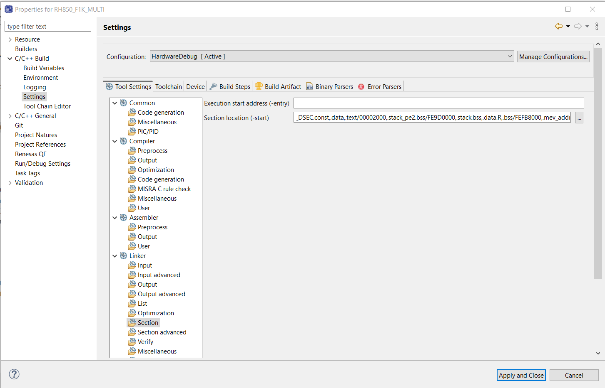

# RH850 F1KM-S4 and F1KH-D8 FreeRTOS Community Supported Demo

## Introduction
This directory contains demo project for Renesas RH850 F1KM-S4 and F1KH-D8

This example implements the standard test demos detailed in following link: [RTOS Third Party Demo](https://github.com/FreeRTOS/FreeRTOS/blob/main/FreeRTOS/Demo/ThirdParty/Template/README.md)

## IDE
- [E2Studio suport RH850 family](https://www.renesas.com/us/en/software-tool/e2studio-information-rh850-family)


## How to use
Open e2studio and import this project File->Open Projects from File System

In order to see log you can add your thread safe transmit function in here or use Dynamic printf feature supported by E2Studio.

```c
int printf (const char * format, ...)
{
    char    tx_buff[100];
    va_list arg;
    va_start(arg, format);
    vsprintf(tx_buff, format, arg);
    va_end(arg);

    /* Put your transmit function here */

    return 0;
}

```

Select the device you want to test by updating the macros `DEVICE_F1KH` or `DEVICE_F1KM` in `bsp\common\coldreset.asm`.

Select the test case you want to run by changing the definition of `configSTART_<Test_Name>_TESTS` in the `freertos\FreeRTOSConfig.h` macros to `0` or `1` as needed.

## Linker

This project also support other single core devices by changing the linker.

**F1KH-D8**
```c
RESET,RESET_PE1,RESET_PEn,STARTUP_CODE/0,ex_entry_PE1/800,.const,.INIT_BSEC.const,.INIT_DSEC.const,.data,.text/00002000,.stack.bss,.data.R,.bss/FEBD0000
```

**F1KM-S4**
```c
RESET,RESET_PE1,RESET_PEn,STARTUP_CODE/0,ex_entry_PE1/800,.const,.INIT_BSEC.const,.INIT_DSEC.const,.data,.text/00002000,.stack.bss,.data.R,.bss/FEEE8000
```

For other devices please check memory maps and update the correspond address.


### Setting Linker



## Note
1. The test case for `portYIELD_FROM_ISR` are out of scope.